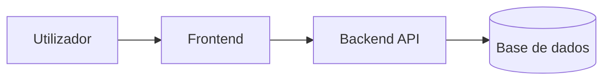

# PROJECT_CONTEXT — <NOME_DO_PROJETO>

Contexto específico deste projeto.

Não inventar informação. Usar `A confirmar` quando algo não estiver validado.

## Identidade

| Campo | Valor |
|---|---|
| Nome | A confirmar |
| Tipo | A confirmar |
| Estado | A confirmar |
| Responsável | A confirmar |

## Objetivo

A confirmar.

## Descrição Profissional

Descrever o projeto por conceitos técnicos e responsabilidades, não por detalhes internos frágeis.

Exemplo:

```text
A aplicação disponibiliza uma interface web para gestão operacional, suportada por uma API backend e uma camada de persistência relacional configurável por ambiente.
```

## Stack

| Camada | Tecnologia |
|---|---|
| Frontend | A confirmar |
| Backend | A confirmar |
| Base de dados | A confirmar |
| Infraestrutura | A confirmar |
| Testes | A confirmar |
| Deploy | A confirmar |

## Arquitetura



## Estrutura

```text
A confirmar.
```

## Comandos

Consultar `COMMANDS.md`.

## Dependências

| Ecossistema | Manifesto | Lockfile | Estado |
|---|---|---|---|
| A confirmar | A confirmar | A confirmar | A confirmar |

## Secrets

| Item | Estado |
|---|---|
| `.env.example` | A confirmar |
| `.gitignore` protege secrets | A confirmar |
| SSH fora do repositório | A confirmar |
| JSON reais fora do Git | A confirmar |

## Produção / Deploy

| Item | Valor |
|---|---|
| Ambiente | A confirmar |
| Servidor | A confirmar |
| Caminho | A confirmar |
| Branch | A confirmar |
| Método de deploy | A confirmar |
| Rollback | A confirmar |

## Quality Gates

| Gate | Comando | Estado |
|---|---|---|
| Testes | A confirmar | A confirmar |
| Lint | A confirmar | A confirmar |
| Build | A confirmar | A confirmar |

## Riscos

| Risco | Impacto | Mitigação |
|---|---|---|
| A confirmar | A confirmar | A confirmar |

## MCP

| MCP | Finalidade | Configuração | Estado | Risco |
|---|---|---|---|---|
| filesystem | Acesso controlado ao projeto | A confirmar | A confirmar | Médio |
| git | Estado, diff e histórico | A confirmar | A confirmar | Baixo |
| fetch/web | Documentação externa | A confirmar | A confirmar | Médio |
| github | Issues/PRs/repos | A confirmar | A confirmar | Médio |
| playwright/browser | Validação UI/E2E | A confirmar | A confirmar | Médio |
| database | Queries e schema | A confirmar | A confirmar | Alto |

Configurações reais com secrets não devem ser versionadas.

## Gestão Evolutiva De MCPs

| Item | Estado | Nota |
|---|---|---|
| MCPs reais verificados | A confirmar | A confirmar |
| MCPs candidatos a adicionar/remover | A confirmar | A confirmar |
| Templates MCP atualizados | A confirmar | Sem secrets |
| Configs reais alteradas | Não | Só com confirmação quando houver risco |
