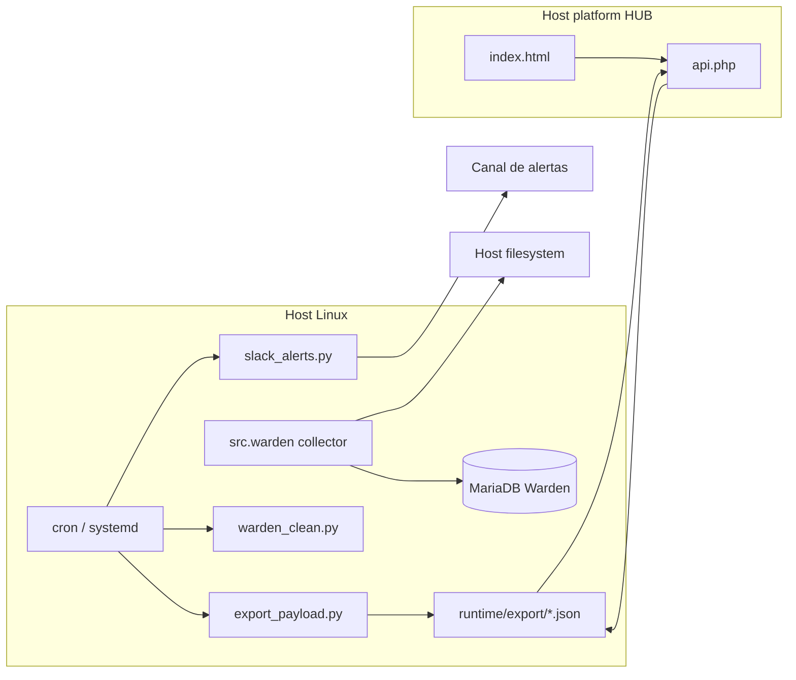

# Warden — Runtime Oficial do Pipeline


Runtime de monitorização agnóstico de plataforma: collector Python, export JSON, alertas configuráveis e UI/API PHP publicável no HUB do host. Recolhe métricas de sistema e MariaDB, persiste no schema `Warden` e expõe snapshots para consumo externo (incluindo proxy no [WELLS_API](../WELLS_API) via `GET /api/warden.php`).

## Funcionalidades principais

- Recolha periódica de CPU, RAM, disco, rede, processos e top consumo de disco.
- Monitorização de schemas MariaDB (tamanhos, crescimento).
- Export de snapshots `fast`, `heavy` e `full` para consumo por API PHP no host ou frontend externo.
- Warden Clean com retenção configurável (`RETENTION_DAYS`).
- Alertas imediatos e digest diário (Slack via `secrets/slack.json` ou `SLACK_WEBHOOK_URL`, nunca versionados).
- Arquivo semanal agregado (`runtime/archive/weekly`).
- Housekeeping conservador via runner `warden_clean`, visível no Overseer.
- Pasta [`public/`](public/) com UI/API Warden (fatia publicável no HUB do host), importável e publicável de forma controlada.
- Scripts PowerShell: import/publicação de `public/`, SSH e limpeza remota.

## Stack tecnológica

| Área | Tecnologia |
|---|---|
| Runtime | Python 3.10+, venv (`.venv`) |
| Dependências | `psutil`, `PyMySQL`, `python-dotenv`, `requests`, … — ver [`src/requirements.txt`](src/requirements.txt) |
| Base de dados | MariaDB/MySQL — schema `Warden`, tabela `warden_metrics` |
| Deploy host | systemd + cron |
| Deploy alternativo | Docker Compose (pipeline only; DB externa) |
| Frontend/API | Versionados em `public/`; publicáveis no HUB da plataforma host |
| CI/CD | Não configurado no repositório |

## Arquitetura



Fluxo resumido:

1. `src.warden` recolhe métricas e grava em `Warden.warden_metrics`.
2. `scripts/export_payload.py` gera `warden_fast_snapshot.json`, `warden_heavy_snapshot.json`, `warden_payload.json`.
3. `api.php` (no HUB do host ou Docker local) serve `ops_fast`, `ops_heavy`, `full`.
4. Jobs auxiliares: Warden Clean, alertas e arquivo semanal.

## Estrutura do projeto

```text
Warden/
├── VERSION                        # Versão SemVer canónica (fonte para releases)
├── LICENSE                        # MIT
├── AGENTS.md, PROJECT_CONTEXT.md, COMMANDS.md
├── CHANGELOG.md
├── README.md
├── docs/ai/                       # Políticas, runbook, handoff, MCP e Skills
├── docs/resources/                # templates/ e examples/ (secrets, config)
├── docs/architecture/             # Deploy, pipeline, produção
├── public/www/                    # UI/API local (Docker :8080)
├── public/backend/                # API PHP canónica + adaptador auth do host
├── deploy/hub/                    # Fatia para publicação no HUB do host
├── src/requirements.txt, src/, scripts/
├── docker/                        # Dockerfiles, Compose, .dockerignore, nginx
│   ├── compose.dev.yml            # Stack web local (UI/API :8080)
│   ├── compose.pipeline.yml       # Collector + scheduler
│   └── compose.sync.yml           # SCP snapshots de produção
├── secrets/, runtime/, docs/
└── tools/ai-adapters/             # Adaptadores de IDE/agentes
```

## Requisitos

- **Host:** Linux com Python 3.10+, MariaDB acessível, systemd (opcional) e cron.
- **Docker (opcional):** Docker Engine + Compose v2; DB MariaDB externa ao compose.
- **Produção (ops):** SSH com chave em `secrets/.ssh/`; ver [`secrets/README.md`](secrets/README.md).
- **Windows (ops):** PowerShell 5.1+ para scripts `*.ps1`.

## Instalação (host)

```bash
cd "$WARDEN_RUNTIME_ROOT"   # ex.: /opt/warden
python3 -m venv .venv
. .venv/bin/activate
pip install -r src/requirements.txt
cp docs/resources/templates/.env.example .env
cp docs/resources/examples/secrets/database.json.example secrets/database.json
# Editar .env e secrets/database.json com valores reais (não commitar)
.venv/bin/python -m src.warden --setup
```

Definir `WARDEN_RUNTIME_ROOT` no ambiente ou em `secrets/production.deploy.local.env` para scripts de ops. Templates antigos usavam `/opt/warden` como path genérico.

## Configuração

| Ficheiro | Função |
|---|---|
| `.env` | Host, DB, retenção, paths de export, alertas, Slack |
| `secrets/database.json` | Credenciais MariaDB do collector |
| `secrets/slack.json` | Alertas Slack (local; ou usar `SLACK_WEBHOOK_URL`) |
| `secrets/production.deploy.local.env` | SSH produção (local, gitignored) |

Variáveis principais (ver `docs/resources/templates/.env.example`):

| Variável | Descrição |
|---|---|
| `RETENTION_DAYS` | Retenção de métricas (ex.: `7`) |
| `EXPORT_PATH`, `EXPORT_FAST_PATH`, `EXPORT_HEAVY_PATH` | Snapshots JSON |
| `MONITOR_ROOT_PATH` | Raiz para métricas de disco (`/` ou `/hostfs` em Docker) |
| `WEEKLY_ARCHIVE_RETENTION_WEEKS` | Retenção de arquivo semanal |
| `ALERT_DISK_WARN`, `ALERT_DISK_CRITICAL` | Limiares de alerta |
| `WARDEN_SLACK_IMMEDIATE` | Ativa alertas imediatos por Slack (`1` em produção) |
| `SLACK_WARNING_*`, `SLACK_CRITICAL_*` | Janelas de confirmação e cooldown por severidade |
| `SLACK_ALERT_MAX_NOTIFICATIONS` | Máximo de notificações por incidente (`5` por defeito) |
| `SLACK_DIGEST_HOUR_UTC`, `SLACK_DIGEST_MINUTE_UTC` | Hora do digest diário Slack (`08:30` por defeito) |

Variáveis da API PHP (host/HUB):

| Variável | Descrição |
|---|---|
| `WARDEN_RUNTIME_ROOT` | Raiz do runtime para resolver snapshots |
| `WARDEN_HUB_ROOT` | Raiz do HUB para secrets partilhados |
| `WARDEN_*_SOURCE_PATH` | Override de paths dos snapshots |
| `WARDEN_AUTH_DB_NAME` | Schema de auth do host (fallback legacy: `MAIATRON`) |
| `WARDEN_API_CACHE_DIR` | Cache da API |

## Utilização

Recolha única e export:

```bash
.venv/bin/python -m src.warden --once
.venv/bin/python scripts/export_payload.py --mode fast
.venv/bin/python scripts/export_payload.py --mode heavy
.venv/bin/python scripts/export_payload.py --mode full
```

Serviço systemd + cron:

```bash
# Ajustar paths em deploy/systemd/warden.service ao deploy real
sudo cp deploy/systemd/warden.service /etc/systemd/system/
sudo systemctl daemon-reload
sudo systemctl enable --now warden
systemctl --user stop warden.service || true
systemctl --user disable warden.service || true
crontab -e   # colar scripts/crontab.example (ajustar WARDEN_ROOT)
```

Contrato operacional:

- Snapshots: `runtime/export/warden_{fast,heavy}_snapshot.json`, `warden_payload.json`
- Retenção: `RETENTION_DAYS=7`
- Janelas UI: `1h`, `24h`, `7d`, `30d` (30d agregado)

## Comandos principais

| Ação | Comando |
|---|---|
| Setup schema | `.venv/bin/python -m src.warden --setup` |
| Recolha única | `.venv/bin/python -m src.warden --once` |
| Export | `.venv/bin/python scripts/export_payload.py --mode {fast,heavy,full}` |
| Warden Clean retenção | `.venv/bin/python scripts/warden_clean.py` |
| Runner `warden_clean` | `WARDEN_ROOT=/opt/warden ./scripts/warden_clean.sh --dry-run` |
| SSH remoto | `.\scripts\Invoke-WardenSsh.ps1` (PowerShell) |
| Limpeza produção | `.\scripts\run-production-cleanup.ps1` |
| Importar `public/` | `.\scripts\import-public-from-prod.ps1` |
| Publicar `public/` | `.\scripts\publish-public.ps1 -DryRun` (depois sem dry-run, com OK explícito) |
| Dev UI/API Docker | `.\scripts\start-warden-dev.ps1` |

## API e frontend

Código em [`public/`](public/); em produção publicado sob `$WARDEN_HUB_ROOT/frontend|backend/...`. URLs dependem do vhost/nginx do host.

| Recurso | URL típica |
|---|---|
| UI (local Docker) | `http://127.0.0.1:8080/` |
| API (local Docker) | `http://127.0.0.1:8080/api.php` |
| UI (produção) | Configurada no reverse proxy do host |

| `action=` | Uso |
|---|---|
| `ops_fast` | Snapshot leve |
| `ops_heavy` | Snapshot pesado |
| `full` | Payload completo |

O adaptador de auth em `public/backend/core/shared/` é opcional e específico da plataforma host onde o HUB está integrado.

## Testes, lint e build

Não há suite de testes automatizada versionada. Validação documentada:

```bash
python3 -m py_compile src/warden.py src/settings.py src/alerts.py src/collector.py src/db_monitor.py \
  src/slack_notifier.py scripts/export_payload.py scripts/slack_alerts.py scripts/slack_daily_digest.py \
  scripts/warden_clean.py scripts/weekly_archive.py
bash -n scripts/warden_clean.sh
```

Smoke local (Docker):

```bash
curl -I http://127.0.0.1:8080/
curl -s "http://127.0.0.1:8080/api.php?action=ops_fast" | head
```

Smoke em produção (ajustar URL ao vhost do host):

```bash
curl -I http://127.0.0.1/apps/warden/index.html
curl -s "http://127.0.0.1/apps/warden/api.php?action=ops_fast" | head
```

**Lint / CI:** não há ferramenta de lint nem pipeline CI configurados no repositório.

## Docker e deploy

### UI/API local (Nginx + PHP-FPM)

```powershell
.\scripts\import-public-from-prod.ps1   # primeira vez (UI do HUB)
.\scripts\sync-prod-snapshots.ps1       # snapshots JSON de prod (SCP read-only)
.\scripts\start-warden-dev.ps1         # http://127.0.0.1:8080/
```

Snapshots em `runtime/export/`: copiar de produção com `sync-prod-snapshots.ps1`, ou gerar localmente com `python -m src.warden --once` e `export_payload.py`.

### Pipeline em Docker (sem PHP)

```bash
cp docs/resources/examples/config/env.docker.example .env.docker
docker compose -f docker/compose.pipeline.yml up -d --build
```

| Serviço | Função |
|---|---|
| `warden-collector` | `python -m src.warden` |
| `warden-scheduler` | cron interno (export, Warden Clean, slack, archive) |

Para alterar a porta do stack web local, definir `WARDEN_DEV_PORT` antes de executar o compose ou `scripts/start-warden-dev.ps1`. Em ambientes onde Docker não consegue montar `runtime/export` diretamente, definir `WARDEN_EXPORT_DIR` para um diretório local alternativo com os snapshots JSON.

Host metrics: `MONITOR_ROOT_PATH=/hostfs`, mount `/:/hostfs:ro`, `pid: host`, `network_mode: host`.

### Publicação do `public/` em produção

Ver [`docs/architecture/warden-public-deploy.md`](docs/architecture/warden-public-deploy.md). **Não altera** o pipeline em `$WARDEN_RUNTIME_ROOT` até pedido explícito.

Deploy pipeline (host): [`docs/architecture/production-step-by-step.md`](docs/architecture/production-step-by-step.md).

## Produção — operações

| Runbook | Conteúdo |
|---|---|
| [`docs/architecture/warden-public-deploy.md`](docs/architecture/warden-public-deploy.md) | `public/`, Docker dev, publish |
| [`docs/architecture/production-access-cleanup.md`](docs/architecture/production-access-cleanup.md) | SSH, diagnóstico e `warden_clean` |

```powershell
.\scripts\setup-secrets-from-wells-api.ps1
.\scripts\run-production-cleanup.ps1 -DryRunOnly
.\scripts\publish-public.ps1 -DryRun
```

O runner `warden_clean` no Overseer deve exportar `WARDEN_ROOT`/`WARDEN_RUNTIME_ROOT`. O crontab real deve conter exatamente uma linha com `# overseer:warden_clean`.

## Troubleshooting

| Sintoma | Verificar |
|---|---|
| API 404 em `ops_fast` | vhost/nginx; path `apps/warden`; snapshots em `runtime/export/` |
| Disco cheio | `df -h`; `warden_clean`; runbook produção |
| Collector duplicado | `systemctl --user` vs `systemctl` — desativar user service |
| Path legado `/opt/warden` | `crontab -l`, `systemctl cat warden` |
| Export vazio | DB `Warden` acessível; `python -m src.warden --once` |
| Docker sem métricas de disco | `MONITOR_ROOT_PATH` e mount `/hostfs` |
| API 401 em Docker local | Auth do host; esperado sem sessão — validar UI estática e PHP a responder |
| `public/` vazio | `.\scripts\import-public-from-prod.ps1` |
| `snapshot_unavailable` em dev | `.\scripts\sync-prod-snapshots.ps1` ou gerar JSON localmente |
| SCP sync: bad permissions | `icacls` na chave em `secrets/.ssh/id_ed25519` (ver `docs/architecture/warden-public-deploy.md`) |

## Segurança e gestão de segredos

- Não commitar `.env`, `.env.docker`, `secrets/database.json`, `secrets/slack.json`, chaves SSH nem `production.deploy.local.env`.
- Usar apenas ficheiros `*.example` no Git.
- Não versionar `runtime/export`, `runtime/logs`, `runtime/cache`, `runtime/archive` (exceto `.gitkeep`).

### Warden Clean — o que nunca apaga

A limpeza operacional em `scripts/warden_clean.sh` cobre retenção de dados, logs grandes, temporários atómicos antigos, cache regenerável, caches Python, ficheiros de editor/sistema, logs textuais SQL grandes e cache Docker antiga. O cron `host-hygiene` (01:30) complementa com journald, logs SO, cache apt e revisões snap desactivadas — nunca remove snaps activos.

**Preserva sempre:** `.git/`, `.venv/`, `secrets/`, `.env`, snapshots ativos em `runtime/export/*.json`, arquivos semanais `runtime/archive/weekly/*.json.gz`, `runtime/cache/.gitkeep`, dados MySQL, binlogs, relay logs, volumes Docker, backups e dumps.

Retenção de arquivos semanais: `scripts/weekly_archive.py` com `WEEKLY_ARCHIVE_RETENTION_WEEKS` — não confundir com o runner diário.

## MCP servers e Skills

| Item | Estado |
|---|---|
| MCP no repo | **N/A** — sem `.cursor/mcp.json` / `.mcp.json` versionado; configurar no IDE se necessário |
| Skills | Pacote canónico em `docs/ai/skills/`; compatibilidade Claude Code em `tools/ai-adapters/claude/.claude/skills/` — inventário em [`docs/ai/skills/README.md`](docs/ai/skills/README.md) |
| Regras para IAs | [`AGENTS.md`](AGENTS.md) |

Documentação de governança:

| Documento | Uso |
|---|---|
| [`PROJECT_CONTEXT.md`](PROJECT_CONTEXT.md) | Stack, paths, comandos, riscos |
| [`docs/ai/ops/HANDOFF.md`](docs/ai/ops/HANDOFF.md) | Estado operacional e próximos passos |

## Métricas de crescimento (v2.x)

O payload expõe crescimento por janela para disco e DB (`disk_*_gb_avg`, `disk_growth_gb_h_avg`, `db.history.*`). No frontend: tabs **Disk** e **DB** com gráficos dedicados. Fallback: deriva `disk_used_gb_avg` a partir de `disk_avg` quando faltarem colunas antigas.

## Changelog

Alterações versionadas: [`CHANGELOG.md`](CHANGELOG.md) (política em [`docs/ai/policies/CHANGELOG_POLICY.md`](docs/ai/policies/CHANGELOG_POLICY.md)).

## Licença e versão

- Versão canónica: [`VERSION`](VERSION) (SemVer; alinhar com `CHANGELOG.md` e badge acima).
- Licença: [MIT](LICENSE)
