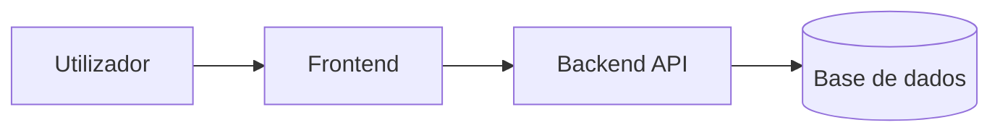

# <NOME_DO_PROJETO>


Descrição curta e profissional do projeto.

> Explicar o projeto por conceitos técnicos: objetivo, domínio, arquitetura e valor. Evitar descrições frágeis como "liga à DB X".

## Visão Geral

A confirmar.

## Funcionalidades

- A confirmar.

## Arquitetura



## Stack

| Camada | Tecnologia |
|---|---|
| Frontend | A confirmar |
| Backend | A confirmar |
| Base de dados | A confirmar |
| Infraestrutura | A confirmar |

## Estrutura

```text
A confirmar.
```

## Requisitos

- A confirmar.

## Instalação

```bash
A confirmar
```

## Configuração

```bash
cp docs/resources/templates/.env.example .env
```

## Comandos

Consultar `COMMANDS.md`.

## Testes

```bash
A confirmar
```

## Docker / Deploy

A confirmar.

## Segurança

- Segredos reais não são versionados.
- Usar `.env.example`.
- Consultar `.agents/policies/SECRETS_POLICY.md`.

## Troubleshooting

| Problema | Solução |
|---|---|
| A confirmar | A confirmar |

## Changelog

Consultar `CHANGELOG.md`.

## Licença

A confirmar.
